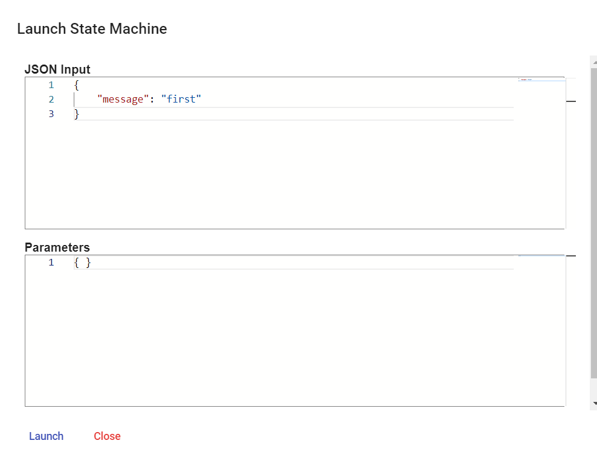
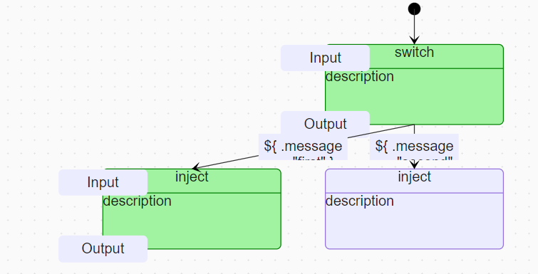

# Switch

> [!WARNING]
> Make sure your working environment is [properly configured](/documentation/gettingstarted/index.html).

Switch state can be added in the workflow, it can be viewed as workflow gateway: they can direct transitions of a workflow based on certain conditions. There are two types of conditions for switch states :
* **Data-based conditions**: cause a transition to another workflow state if evaluated to true.
* **Event-based conditions** : when the referenced event is received then make a transition to an another workflow state.

This tutorial explains how to add `Switch state` in a worklow. Before starting, open the [portal](http://localhost:30003/statemachines) and edit a workflow.

## Add Switch state

In the edition view, drag and drop the `Switch state` into the workflow.
Click on the new `Switch state` and choose the value `Data conditions`.


Add two `Inject state` below the `Switch state` and edit their properties like this :
1. Data property must be equals to `{ "message": "first" }`.
2. Data property must be equals to `{ "message": "second" }`.

Edit the transitions like this :
1. Condition property must be equals to `.message == "first"`.
2. Condition property must be equals to `.message == "second"`.

At the end, the workflow must look like this :


YAML file :

```
id: helloWorld
version: 2
name: name
description: description
start:
  stateName: ccf9ab43-2689-4a43-b621-3cf182ec09fe
states:
  - id: 2138ce2c-ca57-45d9-9ae6-d6f70aced70d
    name: inject
    transition: ""
    type: inject
    end: true
    data:
      message: first
  - id: 594e2dca-4aa0-48ce-8c87-7e9235a59ec1
    name: inject
    transition: ""
    type: inject
    end: true
    data:
      message: second
  - id: ccf9ab43-2689-4a43-b621-3cf182ec09fe
    name: switch
    type: switch
    dataConditions:
      - name: null
        condition: .message == "first"
        transition: 2138ce2c-ca57-45d9-9ae6-d6f70aced70d
      - name: null
        condition: .message == "second"
        transition: 594e2dca-4aa0-48ce-8c87-7e9235a59ec1
functions: []
```

## Launch the workflow

Click on the `Launch` button. A popup `Launch State Machine` will be displayed, pass the JSON `{ "message" : "first" }` in the textarea and click on the `Launch` button.
If the instance is successfully launched then a successful message will be displayed.



Navigate to the `State Machine instances` view and click on the latest instance displayed in the table. The UI displays all the incoming and outgoing tokens of all the states.

